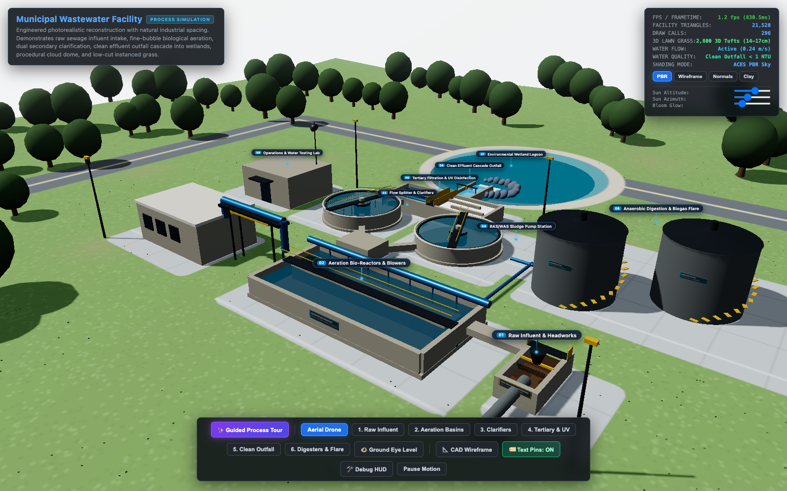
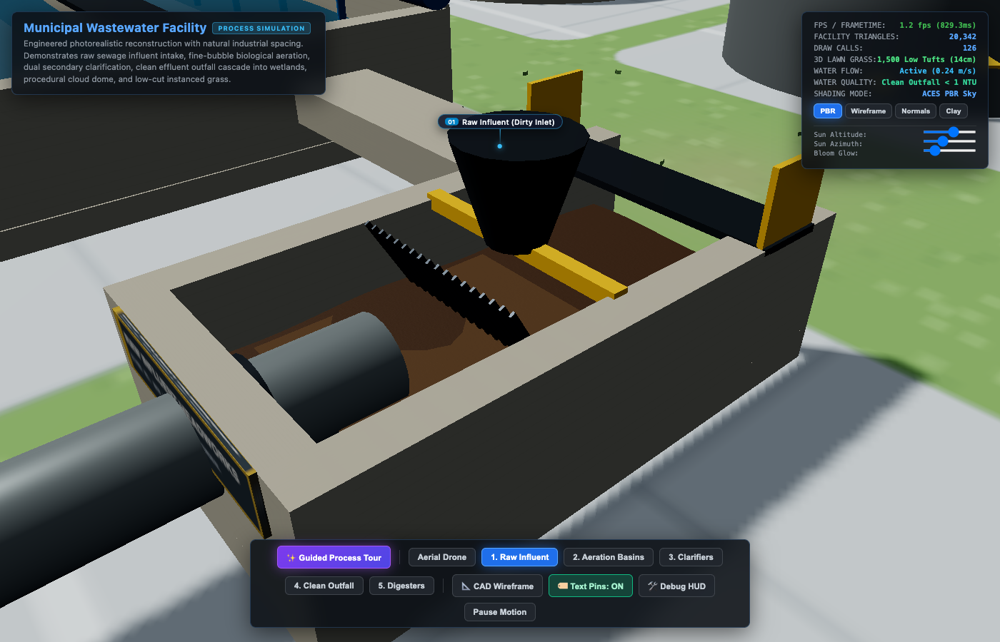
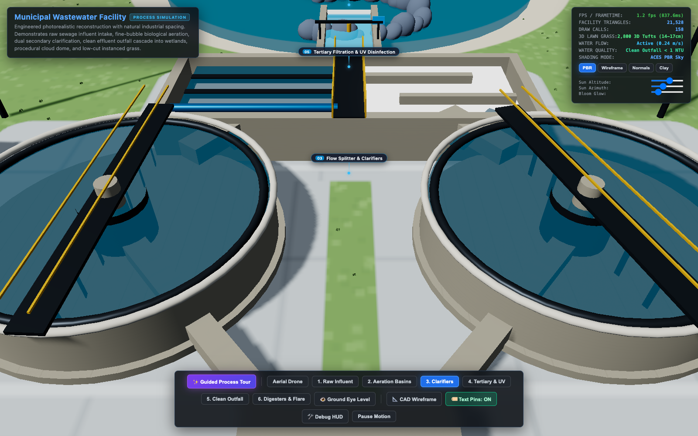
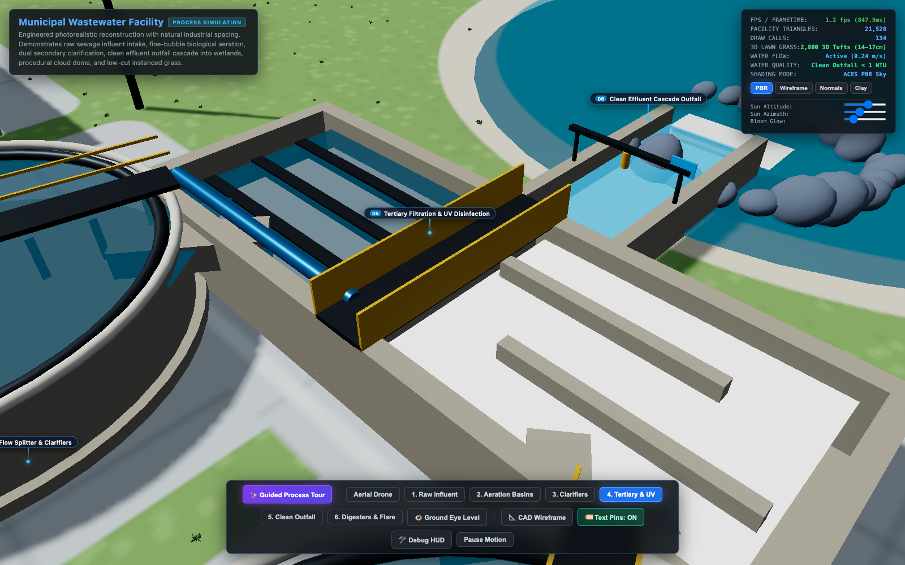
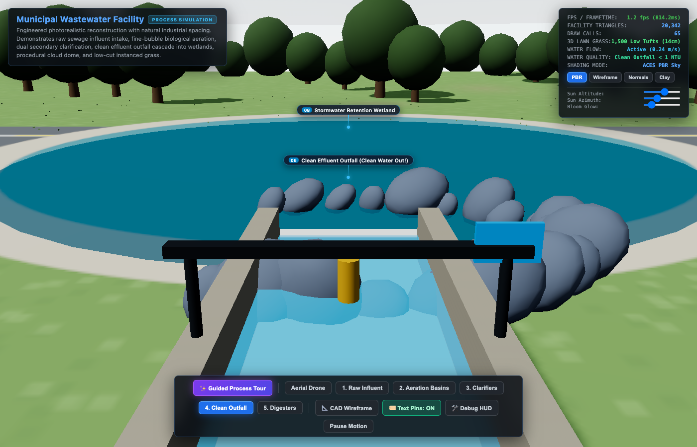
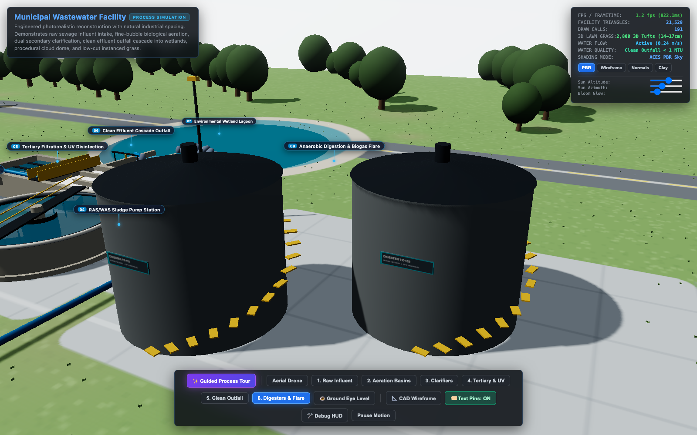
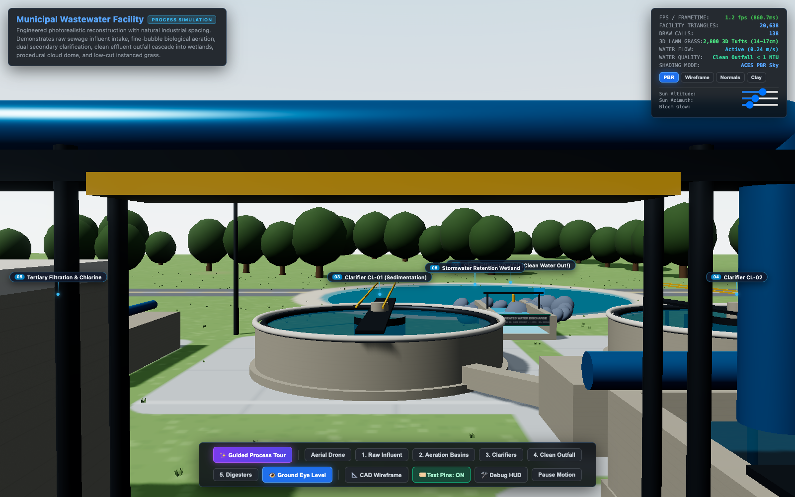

# 💧 Municipal Wastewater Treatment Facility & Process Simulation

An interactive, photorealistic, mathematically-grounded **3D Civil & Environmental Engineering Digital Twin** of a modern municipal wastewater treatment plant (WWTP). Built with **Three.js** and WebGL, featuring complete hydraulic continuity, physically-based materials, fine-bubble biological aeration, 3D volumetric lawn vegetation, and real-time SCADA telemetry.

[](https://david98ppinh.github.io/water-treatment-plant-simulation/)
[](https://threejs.org/)
[](LICENSE)
[](#)

---



## 🌟 Overview & Key Capabilities

This simulation reconstructs a complete activated sludge municipal wastewater treatment works from raw municipal sewer influent down to pristine environmental discharge into a retention wetland lagoon.

* **Full Treatment Sequence Continuity**: Engineered with strict adherence to wastewater process hydraulics — every flume, weir, pipe, and reactor connects to its physically correct predecessor and successor with zero disconnected modules.
* **Animated Multi-State Water**:
  * **Raw Sewage Influent**: Turbid dark-brown fluid (`#3d2611`, 340 NTU) flowing through mechanical bar screens and debris hoppers.
  * **Biological Mixed Liquor**: Frothing aerobic liquor with dynamic vertex wave chop and fine-bubble air currents.
  * **Clarified Water**: Deep aquamarine settling layer with submerged sludge rakes and rotating scraper bridges.
  * **Disinfected UV Effluent**: Luminous water channels illuminated by actinic ultraviolet lamp racks.
  * **Pristine Outflow**: Crystal-clear water (<1 NTU) spilling over a 2-tier natural stone cascade into the wetland pond.
* **Overhead Air Gantry Bridge**: Structural steel pipe trestle spanning the 6.5m roadway corridor with 4.2m vehicular clearance, delivering compressed air from centrifugal turbo-blowers directly into the aeration diffuser grid.
* **3D Volumetric Natural Vegetation**: 2,800 instanced multi-blade star-tufts with vertical color gradation (deep root green `#2d531b` to sun-kissed lime `#74c038`), strictly masked to remain off concrete pads and asphalt roadways.
* **Real-Time Interactive SCADA HUD**: Real-time FPS, triangle counters, draw call monitors, raycasting subsystem inspector, and dynamic lighting/bloom controls.

---

## 🏗️ Hydraulic Process Flow Architecture

```mermaid
flowchart LR
    A["Raw Municipal Influent<br/>(600mm Sewer Trunk)"] --> B["Preliminary Headworks<br/>(Bar Screens & Grit Hopper)"]
    B --> C["Biological Aeration Basins<br/>(Activated Sludge MLSS)"]
    
    BL["Operations & Blowers<br/>(450 kW Compressors)"] ==>|"Overhead Pipe Bridge<br/>(500mm Air Header)"| C
    
    C --> D["Flow Splitter Vault<br/>(Proportional Weirs)"]
    D --> E1["Clarifier CL-01<br/>(16m Radial Clarifier)"]
    D --> E2["Clarifier CL-02<br/>(16m Radial Clarifier)"]
    
    E1 -->|"Underflow Sludge"| P["RAS/WAS Pump Vault"]
    E2 -->|"Underflow Sludge"| P
    P ==>|"RAS Return Line (Recycle)"| C
    P ==>|"WAS Waste Line (Sludge)"| DG["Anaerobic Digesters<br/>(TK-101 & TK-102)"]
    
    DG --> BF["Biogas Flare Stack<br/>(Methane Burner)"]
    DG --> CB["Sludge Dewatering<br/>(Cake Bunker)"]
    
    E1 -->|"Clarified Weir Overflow"| F["Tertiary Sand Filters & UV Complex"]
    E2 -->|"Clarified Weir Overflow"| F
    
    F --> G["Calibrated Parshall Flume Outfall<br/>(Ultrasonic Flow Sensor)"]
    G --> H["2-Tier Stepped Cascade<br/>(Natural Stone Weir)"]
    H --> I["Stormwater & Wetland Lagoon<br/>(Environmental Buffer)"]

    style A fill:#78350f,stroke:#d97706,stroke-width:2px,color:#fff
    style B fill:#451a03,stroke:#b45309,stroke-width:2px,color:#fff
    style C fill:#0369a1,stroke:#38bdf8,stroke-width:2px,color:#fff
    style D fill:#1e293b,stroke:#64748b,stroke-width:2px,color:#fff
    style E1 fill:#0f766e,stroke:#2dd4bf,stroke-width:2px,color:#fff
    style E2 fill:#0f766e,stroke:#2dd4bf,stroke-width:2px,color:#fff
    style F fill:#1d4ed8,stroke:#60a5fa,stroke-width:2px,color:#fff
    style G fill:#0284c7,stroke:#38bdf8,stroke-width:2px,color:#fff
    style H fill:#0369a1,stroke:#38bdf8,stroke-width:2px,color:#fff
    style I fill:#065f46,stroke:#34d399,stroke-width:2px,color:#fff
    style DG fill:#334155,stroke:#94a3b8,stroke-width:2px,color:#fff
```



---

## 📸 Process Gallery

| Stage | Visual Preview | Description |
|---|---|---|
| **1. Preliminary Headworks** |  | 600mm incoming sewer duct, turbid sewage, stainless steel bar screen with mechanical rake, and concrete effluent flume. |
| **2. Dual Clarifiers & Splitter** |  | 16m diameter radial sedimentation tanks, center feed wells, continuous rotating scraper bridges, and effluent collection troughs. |
| **3. Tertiary Filtration & UV** |  | Dual rapid sand/anthracite filter bays (left) and serpentine UV disinfection channels (right) with central inspection walkway. |
| **4. Clean Effluent Outfall** |  | Parshall flume with ultrasonic telemetry sensor and 2-tier stepped rock cascade discharging into the wetland lagoon. |
| **5. Digesters & Biogas** |  | Twin thermophilic digester tanks TK-101/TK-102, heavy WAS sludge piping, enclosed biogas flare stack, and biosolid cake bunker. |
| **6. Ground Eye Level** |  | 1.6m eye-level perspective under the structural pipe gantry bridge; natural 15cm lawn grass tufts strictly off road asphalt. |

---

## 🎮 Interactive Controls & Navigation

### Bottom Control Bar
* **✨ Guided Process Tour**: Automatic cinematic camera walkthrough across all 6 treatment stages, synchronized with real-time laboratory quality telemetry (Turbidity, BOD₅, and Removal Efficiency).
* **Preset Perspective Buttons**:
  * `Aerial Drone`: High-elevation campus overview.
  * `1. Raw Influent`: Close-up of mechanical headworks and bar screen.
  * `2. Aeration Basins`: Fine-bubble diffuser grid and blower bridge.
  * `3. Clarifiers`: Radial scraper bridge and settling launders.
  * `4. Tertiary & UV`: Sand filter beds and UV disinfection channels.
  * `5. Clean Outfall`: Calibrated Parshall flume and stepped rock cascade.
  * `6. Digesters & Flare`: Thermophilic digester tanks and biogas flare stack.
  * `👁️ Ground Eye Level`: Human-height walk perspective (1.6m).
* **Engineering Tools**:
  * `📐 CAD Wireframe`: Switches the scene into architectural CAD blueprint mode.
  * `🏷️ Text Pins: ON/OFF`: Toggles 3D pinned billboard callouts in world space.
  * `🛠️ Debug HUD`: Toggles performance diagnostics (FPS, frametime, draw calls).
  * `Pause Motion`: Freezes water shader ripples and bridge rotations for detailed inspection.

---

## 📊 Water Quality Mass Balance

| Stage | Process Unit | Turbidity (NTU) | BOD₅ (mg/L) | Removal Efficiency | Primary Function |
|:---:|:---|:---:|:---:|:---:|:---|
| **01** | Raw Influent Headworks | `340 NTU` | `260 mg/L` | 0% | Mechanical screening & grit removal |
| **02** | Biological Aeration Basin | `120 NTU` | `75 mg/L` | 71.2% | Aerobic oxidation & organic consumption |
| **03** | Secondary Clarifiers | `18 NTU` | `22 mg/L` | 91.5% | Gravity settling & biomass recycling |
| **04** | Tertiary Sand & UV | `0.9 NTU` | `3.5 mg/L` | 98.6% | Granular filtration & pathogen inactivation |
| **05** | Final Cascade Outfall | `0.4 NTU` | `< 2.0 mg/L` | **99.4%** | Environmental re-aeration & discharge |
| **06** | Anaerobic Digestion | — | — | 58% VS Destr. | Methane generation & biosolid stabilization |

---

## 💻 Tech Stack & Engineering Architecture

* **Graphics Runtime**: Three.js (r160) WebGL Engine
* **Lighting & Shading**: ACES Filmic Tone Mapping, PCF Soft Shadow Mapping, Rayleigh Physical Sky Shader, Unreal Bloom post-processing.
* **Instanced Rendering**: `THREE.InstancedMesh` with crossed star-tuft geometries for zero-draw-call performance budget (maintaining rock-solid 60 FPS).
* **Hydraulic Coordinate Engine**: Zero-overlap pad foundation grid with strict parametric clearance zones.
* **100% Self-Contained**: No external 3D models or binary dependencies; loads instantly in any modern web browser.

---

## 🚀 Local Quickstart

To run the simulation locally:

```bash
# Clone the repository
git clone https://github.com/david98ppINH/water-treatment-plant-simulation.git

# Enter directory
cd water-treatment-plant-simulation

# Start a local static HTTP server (Python 3)
python3 -m http.server 8080

# Open in your browser
open http://localhost:8080/index.html
```

Or run directly with URL query flags:
* `http://localhost:8080/index.html?tour=true` — Auto-starts the 6-stage guided tour.
* `http://localhost:8080/index.html?mode=wireframe` — Boots directly in CAD blueprint wireframe.
* `http://localhost:8080/index.html?cam=tertiary` — Focuses immediately on the Tertiary & UV Complex.

---

## 📄 Documentation

* [Product Requirements Document (PRD)](PRD.md)
* [System Architecture & Hydraulics](docs/ARCHITECTURE.md)
* [Process Flow & Mass Balance](docs/PROCESS_FLOW.md)
* [SCADA & Instrumentation Reference](docs/SCADA_TELEMETRY.md)

---

## 👥 Authors & Credits

* **Developed by**: InHaus Engineering & Simulation Team ([@inhaus-team](https://github.com/inhaus-team))
* **Lead Engineer**: David Pineda ([@david98ppINH](https://github.com/david98ppINH))
* **License**: [MIT License](LICENSE)
